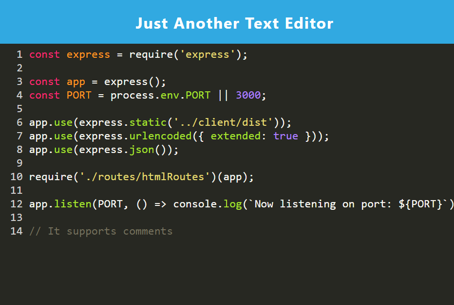

# Just Another Text Editor

## Description

This project was handed to me in the form of starter code given as part of the curriculum for the U of MN's coding bootcamp, as well as a repo provided by our instructor. It is a javascript text editor that is a Progressive Web App that saves your progress even with the loss of an internet connection.

## Table of Contents
- [Installation](#installation)
- [Usage](#usage)
- [Credits](#credits)
- [License](#license)

## Installation

First, clone this repo, then run 'npm run start' in the root of the cloned repo.

## Usage

When the server is running, go to 'http://localhost:3000 to run the app in your browser.

Save code snippets, pseudocode, or just code! JATE will save your changes even if you lose connection to the internet, reload the page, or leave the app and return. This app can be installed to your local machine as well.

## Screenshot

## Credits

<a href='https://garytalmes.com/'>Gary T. Almes (Instructor)</a>

### Collaborators

N/A

### Third Party Attribution

University of Minnesota Coding Bootcamp

### Resources

<a href='https://github.com/garytalmes/pwa_homework'>Starter Code</a>

## License
Liscense under the MIT liscense.

## Features

This application is a text editor that runs in the browser, and can be installed as a Progressive Web App. It will feature a number of data persistence techniques that serve as redundancy in case one of the options is not supported by the browser. The application will also function offline.

## How to Contribute

<a href='https://github.com/garytalmes/pwa_homework'>Starter Code</a>>

## Tests

N/A

## Questions
Contact me by email: glitch0320@gmail.com

---
